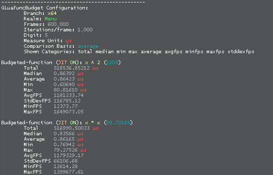

# glua-collectibles
Various GLua scripts/extensions of potential beneficial use.

---

#### [dev_gluafuncbudget](./dev_gluafuncbudget.lua)
A utility that serves to conveniently measure performance of functions.</br>
<sub>Brief documentation can be found within the file.</sub>

<details><summary>Demo</summary>


```lua
gluafuncbudget.Configure( {

	frames = 60--[["fps"]] * 10000--[["cycles/samples"]];
	iterations_per_frame = 1e3;

	digit = 5;

	measure_unit = 'us';
	comparison_basis = 'average';

	shown_categories = 'total median min max average avgfps minfps maxfps stddevfps';

} )

gluafuncbudget.Queue( {

	name = 'x ^ 2';
	standard = true;

	__x = ( 1 + math.sqrt( 5 ) ) / 2
	setup = function( this ) return this.__x end;

	main = function( x ) return x ^ 2 end;
	--[[boolean]] jit_off; -- (for reference)

	--[[function]] after -- (for reference)

} )

gluafuncbudget.Queue( {

	name = 'x * x';

	__x = ( 1 + math.sqrt( 5 ) ) / 2
	setup = function( this ) return this.__x end;

	main = function( x ) return x * x end

} )
```
</details>

#### [lengthenedchatmsgs](./lengthenedchatmsgs.lua)
Increases the maximum message length in the default chat.

#### [net_tablethroughstring](./net_tablethroughstring.lua)
See the heading within the file.

#### [utf8_lowerupper](./utf8_lowerupper.lua)
`string.lower` & `string.upper` with UTF-8 support
```lua
print( utf8.lower( 'АБВ' ) ) -- абв
print( utf8.upper( 'абв' ) ) -- АБВ
```

#### [util_switch](./util_switch.lua)
Switch statement akin to C/C++. JIT-compatible.

#### [client/http](./client/http.lua)
[client/README.md](./client/README.md)

#### [misc/sv_antidoorspam](./misc/sv_antidoorspam.lua)
Self-explanatory.

#### [obj_entity_extend/enablecollisions](./obj_entity_extend/enablecollisions.lua)
See the `Purpose` comment line.

#### [obj_entity_extend/setgravity-improved](./obj_entity_extend/setgravity-improved.lua)
See the first note within the file.
